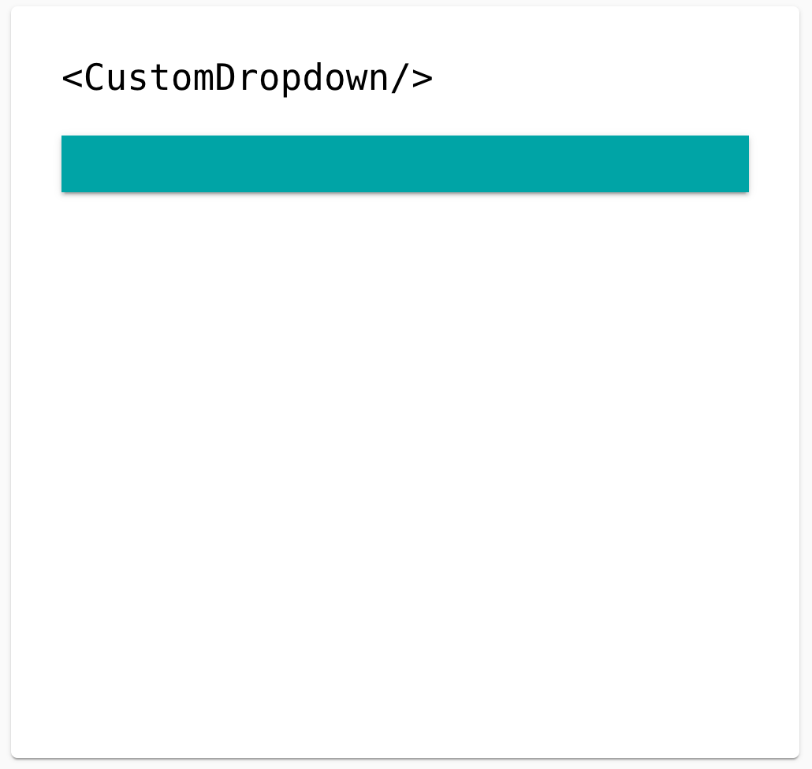
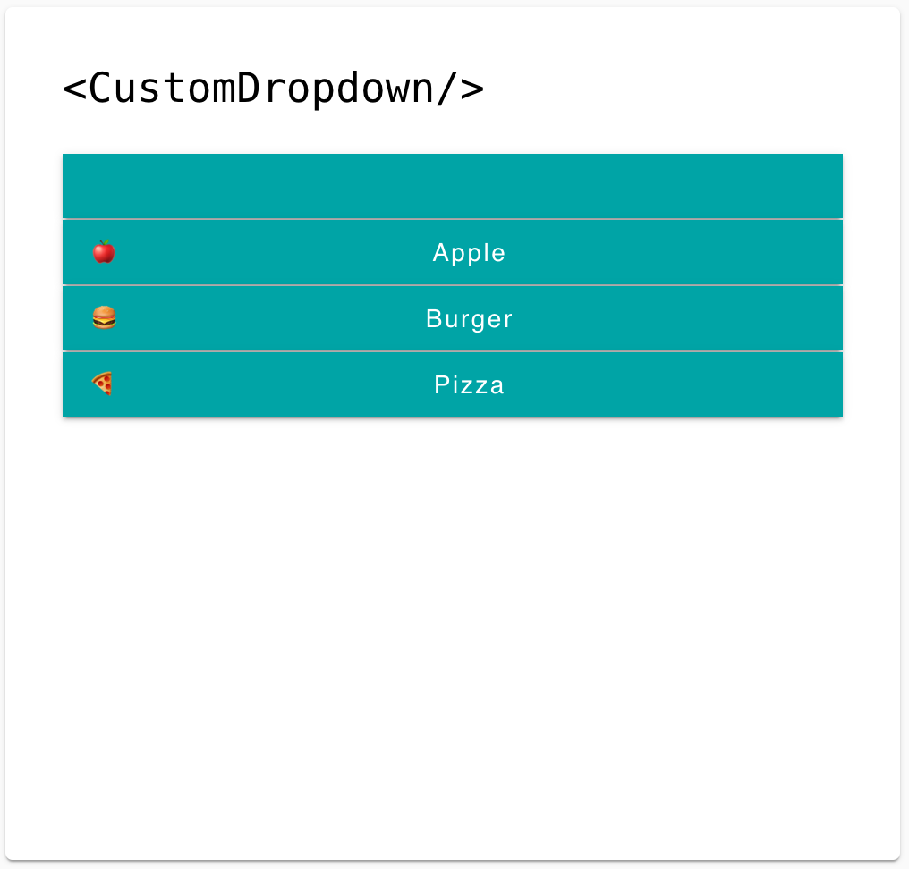
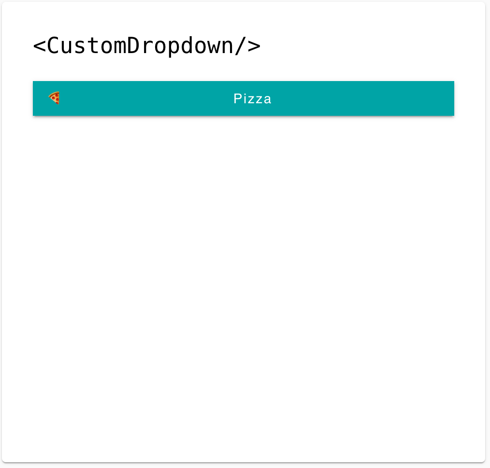

# React Custom Dropdown
Create a reusable dropdown component, named <CustomDropdown> without using <select> or <option> tags

## Requirements
- use HTML <button> elements for all elements (assume styling does not matter)
- <CustomDropdown/> should support the following input props:
    - id: string
    - items: array of dropdown items
    - onChange: function
 Current Value Element
    - The current value element should always render the current value of the dropdown
    - The first render should start with an empty value
    - Clicking on the dropdown should toggle the visibility of the dropdown items in the list
- Clicking any list item should do the following:
    - Update the current value of the dropdown
    - Hide the list items
    - Invoke the method props.onChange(event)
- In the onChange function, event has the shape:
```json
{
    id: string,
    value: {
        label: string,
        value: string
    }
}
```
## Dropdown States
Here's some images displaying different states of the dropdown:
### Initial Render

### After Current Value Element Clicked

### After Item Selected

